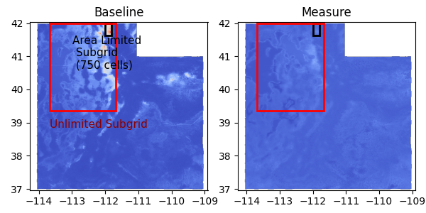

# pyscan-stats Resources – Updated Examples

This repository provides **updated examples** for using the **[pyscan-stats](https://pypi.org/project/pyscan-stats/)** package, a fork from the original **[pyscan](https://github.com/michaelmathen/pyscan)** library by Michael Matheny.

Original documentation:  
https://mmath.dev/pyscan/index.html

---

## Contents

- **Updated examples** (in both Python scripts and Jupyter notebooks)
- **Data** (`.zip`) included for each example, no external downloads required
- **Original Sphinx docs** preserved in [`docs/`](docs/) and [`doc_src/`](doc_src/)
- Ready-to-use `pyproject.toml` with dependencies

---

## Example Setup with uv

### 1. Setup Environment (Python scripts)

1. Install [uv](https://github.com/astral-sh/uv).
2. Create the virtual environment and install dependencies with `uv sync`, activate it with `source .venv/bin/activate`.
3. Unzip the example data files you wish to use.
4. Run the example code.

Example:

```shell
git clone https://github.com/simonpedrogonzalez/pyscan-stats-resources.git
cd pyscan-stats-resources
uv sync
source .venv/bin/activate
cd data
unzip utah.zip
cd ..
python 8_AreaLimitedGridScanning.py
```



NOTE: Jupyter notebooks are also available.

## 🛠️ Need Help?

Feel free to reach out:

📧 simon.pedro.g@gmail.com  
🐙 [GitHub Issues](https://github.com/simonpedrogonzalez/pyscan-stats-resources/issues)

